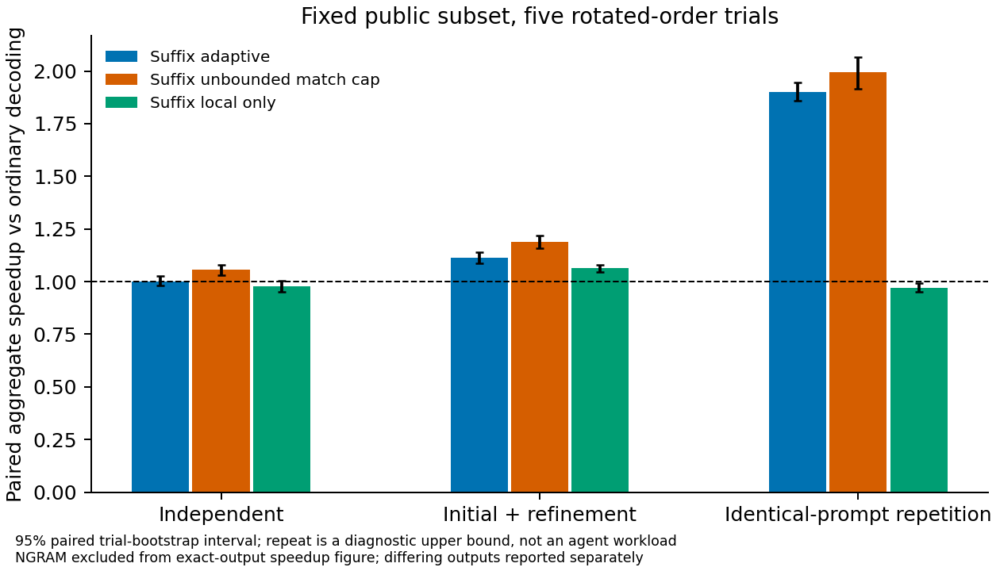
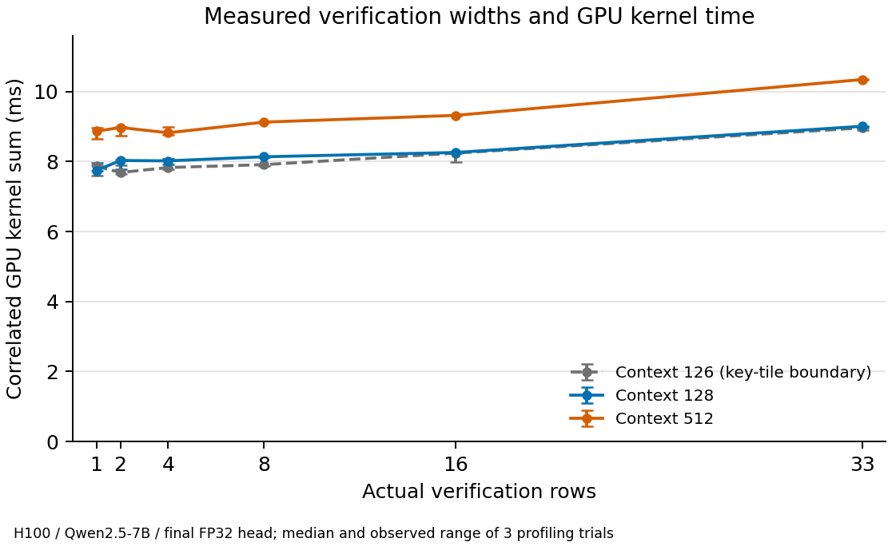

# Measured results: SuffixDecoding in SGLang

All five rotated serving trials completed. Ordinary decoding, adaptive SUFFIX and both suffix ablations match output IDs on all 4,800 measured requests. The unchanged upstream NGRAM baseline is checked separately below. All target-model execution used SGLang; instrumented runs are excluded from serving estimates.

The campaign also passed its plain stop/length/cache gates and 416 direct verification/KV assertions. Full-workload traces add 720 strictly matching suffix requests. Controlled-width profiles match 54 outputs; the ordinary-route control matches all 24 outputs. The portable Linux runner additionally passes four cold/warm smoke requests in its isolated workspace; its complete standalone five-trial orchestration was not separately rerun.

## Controlled serving timings

Qwen2.5-7B-Instruct BF16 weights/activations, FP32-output head, one H100 80GB, TP1/PP1, greedy batch 1. All modes use the shared deterministic Triton attention route, with graphs, overlap and radix caching disabled. The frozen public subset has 52 initial inputs and 32 second turns; each block starts with empty algorithm caches. Warmup is excluded. Ratios are summed ordinary request wall latency divided by mode latency, including host and streaming overhead. Above 1 means faster. Intervals resample the five paired trial blocks; they describe repeat variation on this fixed subset.

| Mode | Independent | Initial + refinement | Identical-prompt repetition |
|---|---:|---:|---:|
| Adaptive dual cache | 0.999× [0.983–1.025] | 1.113× [1.086–1.141] | 1.902× [1.859–1.947] |
| Unbounded match cap | 1.055× [1.032–1.079] | 1.189× [1.160–1.219] | 1.993× [1.915–2.066] |
| Local cache only | 0.977× [0.950–1.005] | 1.063× [1.047–1.078] | 0.970× [0.952–0.993] |

Repetition is a diagnostic upper bound, not an agent benchmark. The unbounded-match-cap ablation does not force 33 executed rows: probability, available continuation and output budget still shorten proposals.

### Actual second turns

The combined refinement block includes first turns. These separate figures use only its 32 second-turn requests per trial (160 measurements per mode).

| Mode | Second-turn latency ratio | 95% paired trial interval |
|---|---:|---:|
| Adaptive dual cache | 1.280× | 1.250–1.310 |
| Unbounded match cap | 1.393× | 1.358–1.430 |
| Local cache only | 1.225× | 1.207–1.244 |

## Upstream NGRAM comparison

NGRAM differs on **50/1,200** timed responses. Its per-anchor fanout is 1, but merged suffix anchors can still branch. Cache policy differs from SUFFIX: trailing 64-token windows in a corpus rather than a full-prompt local tree and response-only FIFO. Every divergence is retained. A real accepted-branch replay isolates one BF16 attention-layout effect with bitwise-identical Q and visible K/V; this does not attribute all mismatches.

Differing NGRAM results are descriptive latency ratios, not exact-output speedups. Token counts expose response-length differences; response quality was not evaluated.

| Block | Descriptive ordinary/NGRAM latency ratio | Differing responses | Ordinary tokens | NGRAM tokens |
|---|---:|---:|---:|---:|
| Independent | 0.965× | 15 | 47370 | 47170 |
| Initial + refinement | 1.122× | 15 | 81285 | 81085 |
| Identical-prompt repetition | 1.938× | 20 | 94740 | 94515 |

## Actual proposals and acceptance

These are separate full-workload traces. The denominator is actual drafts (verification rows minus the pending root), not SGLang's configured 32-draft capacity. Committed emissions clip terminal tails at stop/EOS. Prefill's first token is excluded from verification rounds.

| Variant | Block | Mean verification rows | Draft acceptance | Committed tokens/round | One-row rounds |
|---|---|---:|---:|---:|---:|
| Adaptive dual cache | Independent | 2.09 | 23.3% | 1.25 | 29.7% |
| Adaptive dual cache | Initial + refinement | 2.32 | 28.4% | 1.38 | 25.5% |
| Adaptive dual cache | Identical-prompt repetition | 3.15 | 63.2% | 2.36 | 28.0% |
| Unbounded match cap | Independent | 18.82 | 1.8% | 1.33 | 31.4% |
| Unbounded match cap | Initial + refinement | 19.45 | 2.5% | 1.47 | 27.2% |
| Unbounded match cap | Identical-prompt repetition | 19.50 | 8.1% | 2.50 | 29.6% |
| Local cache only | Independent | 1.81 | 25.7% | 1.21 | 46.4% |
| Local cache only | Initial + refinement | 2.01 | 32.1% | 1.32 | 42.7% |
| Local cache only | Identical-prompt repetition | 1.81 | 25.7% | 1.21 | 46.4% |

Controlled ablations change one proposer policy at a time. Ratios compare adaptive dual-cache speedup with each ablation's speedup, using paired trial wall times and 95% trial-bootstrap intervals. Above 1 favors adaptive dual-cache SUFFIX. These describe the same fixed trials; they are not independent experiments or population-general estimates. Removing the match-length cap can change the winning continuation in the author's cumulative-score search, as well as its length.

| Block | Adaptive / unbounded-match-cap speedup [95% interval] | Adaptive / local-only speedup [95% interval] |
|---|---:|---:|
| Independent | 0.947× [0.915–0.985] | 1.023× [0.996–1.046] |
| Initial + refinement | 0.936× [0.932–0.940] | 1.048× [1.024–1.071] |
| Identical-prompt repetition | 0.954× [0.935–0.980] | 1.960× [1.935–1.985] |

- Adaptive match-length cap, compared with its ablation: independent **slower**; initial + refinement **slower**; identical-prompt repetition **slower**.
- Global response cache, compared with its ablation: independent **inconclusive relative to 1**; initial + refinement **faster**; identical-prompt repetition **faster**.

## GPU work and the baseline route

| Context tokens | One-row kernel sum | 33-row kernel sum | Reduction at one row |
|---:|---:|---:|---:|
| 126 | 7.865ms | 8.962ms | 12.2% |
| 128 | 7.745ms | 9.006ms | 14.0% |
| 512 | 8.865ms | 10.342ms | 14.3% |

Correlated launch grids at context 128:

| Kernel family | One-row grids | 33-row grids |
|---|---|---|
| kv_store | `[[2, 1, 1]]` | `[[66, 1, 1]]` |
| argmax | `[[1, 19, 1]]` | `[[33, 16, 1]]` |
| attention | `[[1, 28, 1]]` | `[[1, 28, 1]]` |
| lm_head | `[[132, 1, 1]]` | `[[132, 1, 1]]` |

These medians summarize three randomized controlled-width profiles. Launch grids distinguish work changes from masked padding; the table makes unchanged attention/head tiles visible. Kernel-duration sums include profiler effects and are neither request wall time nor measured FLOPs. Context 126 crosses a 64-key tile boundary. Forced zero candidates remain subject to target verification and are never injected into outputs.

The separate six-pair ordinary control gives a shared/original route cost ratio of **0.983×** [0.952–1.019]. Above 1 means the shared route is slower. Only two writing prompts with matching observed outputs were selected; this is a narrow cost control, not a representative optimized-upstream comparison. The common head-stride fix avoids the previously measured 1.09GB copy on every forward in all modes.

## Performance behavior and limitations

- Adaptive SUFFIX on independent inputs: **inconclusive relative to 1**, pooled ratio 0.999× [0.983–1.025].
- Adaptive SUFFIX on actual second turns: **faster**, pooled ratio 1.280× [1.250–1.310].
- Adaptive SUFFIX on identical-prompt repetition: **faster**, pooled ratio 1.902× [1.859–1.947].

This adapted experiment provides evidence of a gain on actual second turns, identical-prompt repetition. The remaining rows, including negative or inconclusive results, constrain that finding.

This is an adaptation, not the paper's original numerical result: Qwen2.5-7B in SGLang replaces its Llama/vLLM setup; the output cache is bounded to 128 requests; the public subset is small; execution is eager; no proprietary AgenticSQL or live OpenHands trajectory is reproduced. Each block has at most 104 requests, so the serving experiment does not measure eviction pressure at that bound. Host checks cover FIFO eviction. Five repeated timings do not establish workload generalization. Exact IDs on this finite suite do not prove arbitrary-input hidden-state equivalence. Cache reuse, kernel padding, CPU overhead and the modified ordinary route all affect the result. Request wall latency includes CPU proposal/cache work, which is not separately isolated by the controlled-width kernel sums.

## Reproducibility

Campaign: `modal-20261004-final-campaign-resumed`. Diagnostics: `modal-20261005-final-diagnostics`. Immutable runtime image: `im-96vGJgQDElG1UZq72yqyhI`; image IDs identify provenance in the original Modal workspace rather than public portable images.

Integration patch SHA256: `19fc2ced20cde74fef8bfb0e7baeaada3430fc2a4d8096597e1778da1d2327bf`. Workload SHA256: `8b94953aa6e1c8ec18e4f9c405f82cf87d4c330ad172be118e0547e4c657132c`. Dependency lock SHA256: `c0a19671efe44499b964370a3932dcb1d6abca143c0fbf7f1fd65f0e44f85510`.

The JSON reports retain raw-file hashes, IDs, resolved configuration, GPU UUIDs, package freezes, trace hashes and per-trial measurements. Exact runtime source snapshots and selected numerical fixtures are public in the attribution audit release. See [GPU runbook](GPU_RUNBOOK.md), [technical design](TECHNICAL_REPORT.md), and the committed `results/final/` reports. Timing and profile artifacts are separate release assets; no model weights or credentials are distributed.

The original campaign `modal-20261004-final-campaign` was canceled after its complete first trial. The resumed campaign preserved only complete paired trials and reran incomplete trials on a fresh allocation. Every five-mode trial stayed on one physical GPU; allocations can differ between trials, as recorded by GPU UUID. The original failed status, log and discarded partial records are retained under `resume-source/` in the serving archive. Model, runtime and frozen input hashes are unchanged.
