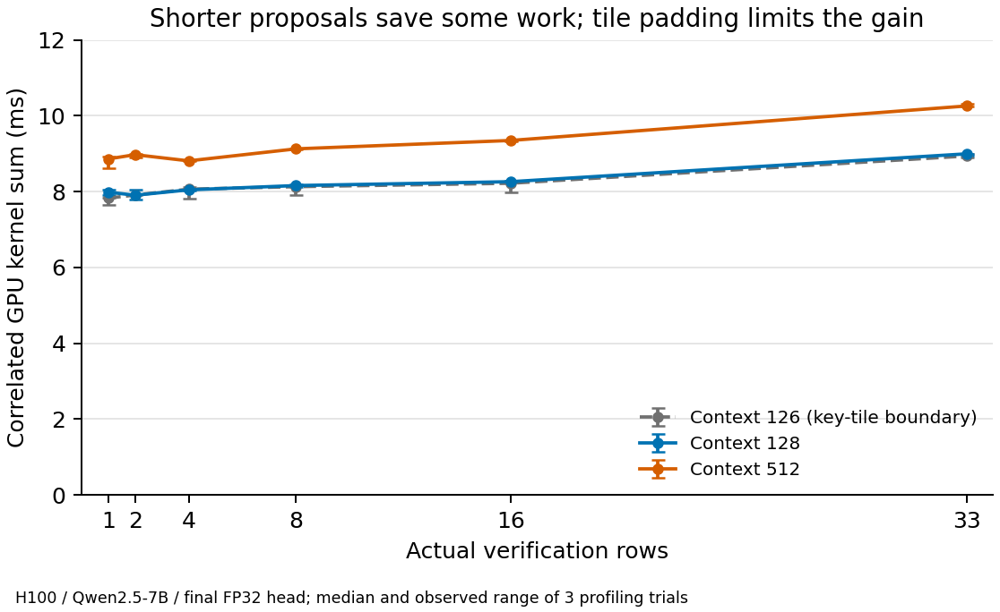

# A linear SuffixDecoding adaptation for SGLang

**Status: SUFFIX passes the full 240-request public-workload exact-ID gate in the retained v12 configuration. Five serving trials are running. Upstream NGRAM still has output differences.** No serving speedup or reproduction of the paper’s headline performance is established yet. SGLang executes Qwen2.5-7B-Instruct on one H100 80GB. All failed configurations remain available alongside the passing configuration.

## Algorithm and integration

[SuffixDecoding v3](https://arxiv.org/html/2411.04975v3#S3) combines a per-request prompt/output suffix tree with a global output tree. Longer matching suffixes permit longer proposals; occurrence counts rank continuations. This adaptation uses the author implementation’s linear greedy mode. It preserves dual caches and adaptive lengths without adding a draft model, training, tree verification, batching or a hybrid fallback.

The C++20/nanobind module is reused from the pinned ArcticInference commit. Its native matching, occurrence counts and tie behavior are unchanged. Only the Python import namespace and an incorrect default-cap attribute are repaired. Native file hashes and Apache notices are retained. This project installs no vLLM execution plugin.

For a matching suffix of length p, the proposal cap is `min(32, remaining_output - 1, floor(alpha*p + offset))`, initially alpha=1 and offset=0. Native continuation probabilities are multiplied along a path; a 0.1 threshold can stop expansion earlier. The sum of these estimated probabilities scores candidates across both caches and match lengths. These are historical frequency estimates, not calibrated target-model probabilities. Native lookup tests match lengths below the provided context length, an exclusive upper bound retained from the author code.

SGLang v0.5.21 already has an NGRAM worker with a model-free verifier and KV movement. `SUFFIX` uses that scheduler family and subclasses the worker, replacing its proposer with the author CPU cache. The adaptation touches eight SGLang files: algorithm dispatch, NGRAM initialization/cleanup, the suffix worker, configuration validation, completion handling, abort handling, and a common deterministic FP32-head matmul correction, and an opt-in shared attention route. The committed patch reconstructs the integration at the exact upstream commit; upstream acceptance is unnecessary.

At request start, the local tree receives the full prompt. Both trees receive only scheduler-committed output; the global tree never receives prompts. Completion removes the local tree and retains the response in a FIFO cache of 128 requests. Prefill-only completion has an explicit hook. Abort removes the response, and flush replaces both caches. Stop processing uses `output_ids_through_stop`, preventing insertion of rejected drafts or output past a stop condition.

## Verification and the pending KV token

Let P be prompt length and n the number of already-emitted output tokens. The last output token occupies position `P+n-1`; it is emitted but its KV is pending. With k drafts, the verifier processes `[pending root, draft1, ..., draftk]`, using k+1 actual rows and a triangular causal chain mask. Row0 predicts draft1, and the last row predicts a full-match bonus.

If a draft differs from the target prediction, accept only the preceding matching prefix and emit the target correction. With a matching prefix of length a, the result emits A=a+1 tokens and settles A processed input slots starting at `P+n-1`. The new correction or bonus remains pending for the next forward. This preserves the one-token offset between emitted output and processed KV.

For example, if draft1 and draft2 match but draft3 fails, the forward settles the KV of the old root, draft1 and draft2. It emits draft1, draft2 and the correction. The correction’s KV is computed next time. Moving the correction into KV immediately, or retaining draft3’s KV, would break later conditioning.

`NgramVerifyInput` and scoped runtime configuration carry the actual width into attention metadata and sampling. Capacity-sized buffers are sliced to that width. The inherited greedy sampler accepts a contiguous chain, the inherited KV mover settles accepted inputs, and result stride tells the scheduler how to unpack outputs. Empty proposals execute a one-row verification. The scheduler still reserves the maximum 33 slots; reservation and executed rows are separate costs.

## Numerical correctness evidence

Ten Mac/Linux host tests cover cache separation, FIFO eviction, ID reuse, native integrity, adaptive bounds, 100 randomized oracle generations, worker shape contracts, output caps, stop-truncated completion, abort, flush and explicit width-probe validation. Host worker tests stub the target; they do not establish GPU KV correctness.

The initial plain GPU gate compares 30 cases per mode with ordinary decoding: output caps 1/2/3/17/33/65/128, EOS, a stop string and an unfavorable draft context, repeated across cold, warm and flushed caches. Both NGRAM and SUFFIX match all output IDs. A separate suffix audit checks 416 verification rounds: actual positions and linear retrieval links, emitted argmax prefix, first rejection/correction, sequence advancement, bitwise preservation of the existing KV prefix in every layer, and accepted logical-slot identity. These assertions verify the exercised path; they do not establish bitwise equality of all hidden states for arbitrary inputs.

Earlier failures informed the initial passing settings rather than being discarded:

| Configuration | NGRAM exact cases | SUFFIX exact cases | Finding |
|---|---:|---:|---|
| Default BF16/FlashInfer | 27/30 | 27/30 | Both speculators diverged at tides output127. |
| Batch-invariant FlashInfer, split 4096 | 30/30 | 29/30 | Warm suffix differed at output113. |
| Same with FP32-output logits | 30/30 | 27/30 | FP32 head alone did not resolve the differences. |
| Triton/FP32, NGRAM breadth 10 | 29/30 | 30/30 | Branching NGRAM differed on a warm case. |
| Triton/FP32, breadth 1 | 30/30 | 30/30 | Restricted per-anchor fanout; direct suffix KV audit passes. |
| Triton with native BF16 logits | 24/30 | 24/30 | Often near ties; unsuitable for the exact-ID gate. |
| Triton/FP32, preserved weight strides | 30/30 | 30/30 | Final configuration also passes without audit instrumentation. |

One new KV diagnostic initially indexed an extra layer and failed before suffix generation. That was our diagnostic error; it was corrected and the failed run preserved. Logit margins and passing acceptance/KV assertions narrow the earlier investigation, but do not identify every kernel responsible for the numerical differences. The project therefore makes no blanket attribution to SGLang or to harmless rounding. The broader public gate exposed a substantial limitation: NGRAM differs from ordinary on 123/240 requests (27 independent, 43 refinement, 53 repetition). The interrupted suffix run differs on 13/28 completed requests. Ordinary initial outputs reproduce the frozen baseline. Timing trials and their controller were stopped; these raw times cannot establish an exact-output performance comparison. Both speculators failing broader prompts makes the shared target execution path a concrete investigation target. Ordinary Triton decode uses a different attention kernel from deterministic target verification; the v12 experiment routes ordinary decode through the existing unified verification attention kernel. On an eight-prompt control, original decode yields six NGRAM mismatches; shared attention yields none for NGRAM or SUFFIX. Shared ordinary outputs equal original NGRAM outputs on all eight. This supports a numerical execution-path explanation for these prompts; it is not a full-workload correctness claim. This small control was followed by the broader v12 gate described below. No proposer, acceptance or KV movement changed. The decode KV index list already includes the just-written pending root, so the shared route reuses it without appending another root.

The full v12 gate did not pass: 240 ordinary and 136 NGRAM requests completed, with six NGRAM differences across q112, q114 and q151 (initial and refinement). The local client disconnected and canceled execution before SUFFIX ran. This is an interrupted, already-failing gate, not a serving result. Complete available records are retained in `results/modal/modal-20261004-v12-full/`.

An independent reassessment then removed the entire project patch in an immutable Linux image and verified an empty SGLang diff at the pinned upstream commit. The suffix adapter was absent. On four selected contexts (the three failed first turns and q114 refinement), executed cold then warm, pristine ordinary/NGRAM match on 5/8 requests. Applying only the head-copy fix leaves all eight outputs unchanged in each mode. Adding only the existing shared-attention route yields 7/8 ordinary/NGRAM matches: it changes the two q114 ordinary outputs, while all NGRAM outputs remain identical. q112's cold case still diverges at output 125. These 48 diagnostic requests demonstrate that the suffix adapter is not necessary for these specific differences; they do not establish broad adapter correctness or assign every remaining failure to upstream. The smaller diagnostic cache history also differs from the full gate. Source diffs, settings, dependency freeze and raw IDs accompany `results/reassessment-summary.json`.

The common-attention experiment changes the ordinary baseline as well as its outputs. Its eventual timings characterize this shared deterministic execution configuration. They cannot establish a gain against optimized upstream ordinary decode or a pure suffix-proposer change. Decision score: **96/100** for independent attribution and fixed-input numerical controls; **35/100** for continued attention patches without those controls. The isolated full SUFFIX gate subsequently passes, as described below; timed SUFFIX and ablation outputs remain subject to exact equality.

An isolated attention control then held Q/K/V fixed while varying causal/custom mask specialization, query-row position, width, packed-QKV versus contiguous query layout, and linear versus permuted physical KV addressing. With Qwen's 28 query heads, 4 KV heads and 128-dimensional heads, all 3,840 query-row fixtures were bitwise equal on H100. Prefixes were 79/104/128/240/512, widths 1/2/4/8/16/33, three seeds. This provides no support for the proposed all-true ordinary custom-mask patch, which was archived and removed without a model-level test. Synthetic equivalence does not establish real-model equivalence; subsequent leaf dumps and exact captures are described below. Raw records and hashes accompany `results/attention-equivalence-summary.json`.

SGLang's upstream tensor-dump facility reproduced q112's cold output 125 difference. The first parser assumed a contiguous proposal chain; that assumption was wrong for NGRAM PROB. Its native `Trie::matchProb` selects up to the configured fanout from each suffix anchor, then merges paths from all anchors. Consequently fanout 1 can still produce branches. The saved pass 25 positions/tokens confirm that the accepted path uses rows 0/2/4, skipping siblings 1/3. The old parser skipped row 4 and attributed the first visible difference too late, at position 120. Its raw tensors and original code are preserved, but that attribution is marked superseded. The updated generic parser rejects non-linear position layouts without actual masks. The cached RoPE module is also shared across layers; repeated hooks overwrite named outputs with the last call, so those labels cannot locate a layer's first difference.

Exact capture at layer 3/position 120 shows identical Q but differing visible KV only at position 118: 39 key and 61 value elements. Each output replays exactly from its own captured inputs. Query/KV truncation and zeroing future values do not remove the difference. The cached value equals pass 25 row 4's projected value, narrowing the cause before KV movement. A direct comparison of that accepted branch with ordinary position 118 finds one differing BF16 attention element in layer 2 (absolute delta 0.0001220703125); all earlier recorded operators agree. The subsequent actual-mask replay at layer 2/position 118 captures bitwise-identical Q and visible K/V. The correct tree path uses physical columns 0–116,118,120. Replaying the original tree reproduces its one-element BF16 output difference exactly. A single-query replay with the same holes also differs; compacting the same visible keys restores ordinary equality with either one or 33 query rows. Thus query-row count is not necessary for this effect: the masked key layout is sufficient. Floating-point operation grouping is a plausible explanation, not a measured instruction-level attribution. This fixture does not explain every NGRAM difference or establish universal KV correctness.

These findings are in `results/attention-capture-summary.json`, `results/kv-origin-summary.json`, `results/branch-leaf-summary.json`, and `results/branch-attention-summary.json`. Full tensor dumps are downloaded and hashed; exact diagnostic versions are preserved in `analysis/snapshots/`. Hooks synchronize and disable server warmup, so these are numerical diagnostics only. A separate unchanged-v12 SUFFIX gate now matches all 240 requests against that image's completed ordinary reference, including all 52 independent, 84 initial/refinement and 104 repeated-prompt requests. Cross-allocation equality is a correctness control, with no latency comparison between allocations.

## Do adaptive widths reduce GPU work?

A smaller host tensor does not guarantee proportional hardware savings: CUDA graphs or internal kernel tiles may still pad it. Graphs and overlap are disabled here, and actual target rows change. Separate traces correlate CPU verification spans with their CUDA launches and GPU kernels.

The first profile, before the head-copy correction, used a 126-token prompt, six widths and three randomized trials. All 18 outputs matched ordinary generation. One-row median summed kernel time was 12.93ms versus 14.00ms at 33 rows. This context crosses a 64-key tile boundary, so it cannot isolate a uniform per-row benefit.

The final profile uses contexts 126/128/512 and widths 1/2/4/8/16/33, three randomized trials each. All 54 outputs match ordinary IDs. Forced candidates are zero IDs and remain subject to target verification; they are never injected directly into outputs or caches.

| Input context tokens | One-row median kernel sum | 33-row median kernel sum | Reduction at one row |
|---:|---:|---:|---:|
| 126 | 7.83ms | 8.94ms | 12.4% |
| 128 | 7.98ms | 8.99ms | 11.2% |
| 512 | 8.86ms | 10.26ms | 13.6% |

KV-store grids grow from `[2,1,1]` to `[66,1,1]` per layer, and argmax from `[1,19,1]` to `[33,16,1]`. These launches establish actual reduced GPU work, beyond masking padded host execution. Attention keeps `[1,28,1]`, and the persistent head matmul keeps `[132,1,1]`. Summed kernel durations are profiler diagnostics, not request wall latency or hardware FLOP counts.

Source inspection explains the limitation. The FP32-output head uses a 128-row M tile, remapping padded rows to row zero before its dot product. Deterministic unified attention selects a 128-row query tile for Qwen’s 128-dimensional heads on H100, with 64-token key tiles. Dense GEMMs also use tiled kernels. Reducing 33 rows to 1 therefore saves some storage/reduction work while substantial arithmetic remains padded. It does not produce a 33-fold compute reduction. Full samples, kernel grids and trace hashes are in `results/width-probe-final/`.

## A shared inference-system cost exposed by profiling

The original deterministic FP32-head path copied a 1.09GB transposed weight tensor on every forward. `_mm_dtype_compat` called `.contiguous()` on `weight.T` before invoking a Triton matmul that already supports explicit strides. The large copy kernel took about 4.8ms in the first profile.

A guarded change retains the transposed weight view for FP16/BF16 inputs with FP32 output, selecting the same existing stride-aware Triton calculation. Other cases retain the upstream fallback. It applies equally to ordinary decoding, NGRAM and SUFFIX. The final CPU trace contains the head matmul without its large contiguous/clone/copy operations; the corresponding copy kernel is absent in all 54 measured first-verification spans. Correctness/KV checks pass. Cross-image profile differences are not a randomized estimate of this fix’s serving speedup.

The synthetic CPU cache microbenchmark contains 12,800 lookups, with median 4.25 microseconds on the development Mac. It establishes neither model throughput nor a comparison to the paper’s CPU timing. Real serving costs include cache updates, Python/native transitions, eager kernel launches, synchronization, mask construction and stream handling.

## Controlled serving experiment

The model is Qwen/Qwen2.5-7B-Instruct at revision `a09a35458c702b33eeacc393d103063234e8bc28`. One Modal H100 80GB HBM3 uses driver 580.95.05. The Linux environment is Ubuntu 24.04 / Python 3.12 / CUDA 13.0.3, with 212 hashed package pins, Rust 1.92 and an upstream Cargo lock. Installation, Rust/native builds, pip check, Engine import and the exercised text-inference path pass. A failed CUDA-tile downloader-stub hash resolution is retained; a verified direct NVIDIA wheel replaces it without disabling hash checking.

Every mode uses BF16 weights/activations, FP32-output logits, deterministic operations, Triton attention, decode split 4096, TP1/PP1, batch 1, page 1, seed 42, context 16384 and 75% static memory fraction. Graphs, overlap and radix prefix caching are disabled. These common settings isolate this eager adaptation; they do not characterize the fastest production SGLang configuration.

The public workload takes the first four Spec-Bench prompts per category in source order: 52 initial prompts across 13 categories and 32 available second turns. Refinement inputs incorporate assistant text generated once by ordinary decoding. All tokenizer IDs are frozen, with no truncations and a maximum 918 input tokens. The frozen second-turn text was generated under v11 ordinary decode, before the shared-attention change; it remains fixed across the candidate modes. Historical baseline output IDs are retained for provenance and never used as the candidate equality reference or cache seeds. SHA256 is `8b94953aa6e1c8ec18e4f9c405f82cf87d4c330ad172be118e0547e4c657132c`.

Each mode/trial executes 52 independent requests, 84 initial/refinement requests, and 104 requests in a repeated-prompt diagnostic block. Temperature is 0, output cap 256, EOS honored. Warmup executes every frozen prefill shape and every suffix verification width. Algorithm caches are then reset; each block begins empty and persists only causally within the block. No future answer seeds a cache. Five trials rotate mode order on one GPU, with no parallel GPU workload.

The modes are ordinary, upstream NGRAM PROB (33 slots, breadth 1, trie depth 64), dual-cache adaptive suffix, suffix with the match-length bound removed, and local-only suffix. NGRAM inserts trailing 64-token context windows after verification into its shared corpus; it does not populate a full-prompt local tree at prefill. Its resolved capacity is 10,000,000 entries. Fanout1 restricts children per suffix anchor; merged PROB paths can still form a tree. SUFFIX uses full prompt/output locally and a response-only FIFO globally. This baseline therefore differs in cache policy as well as proposal scoring; the two suffix ablations isolate the match-length bound and global cache more directly.

The script label `suffix-fixed` means the unbounded match-length ablation; it does **not** force a fixed executed width. Candidates can still be shortened by probability, missing continuation or remaining output budget.

Raw records include all output IDs, per-request wall latency, first streamed-chunk latency, chunk timing/token counts, model metadata, workload/patch hashes, resolved server settings, package freeze and NVIDIA state. Total latency includes host and streaming overhead. Speedup is the paired ratio of summed ordinary request latency to mode latency, reported separately by block. Five complete trials, source/configuration checks and exact ordinary/SUFFIX/ablation IDs are required before aggregation. The original all-five-mode exact-ID policy is explicitly revised after the branch replay: NGRAM differences are recorded and its differing-output timings are descriptive latency ratios, excluded from exact-output speedup figures. This retains the requested upstream baseline without changing its proposal topology. Decision score: **93/100**. The report defaults to rejecting all differences; accepting NGRAM differences requires the explicit `--allow-ngram-numerical-differences` flag. No SUFFIX differences are permitted. Paired trial bootstrap intervals describe repeat variation on this fixed subset, not generalization to all workloads.

Profiling runs are separate from timed trials. SGLang’s `spec_num_proposed_drafts` and `spec_accept_rate` metadata use the configured 32-draft capacity, so they overstate actual adaptive proposal counts. Raw fields are retained; actual suffix width/acceptance distributions come from the separate per-round trace. Latency comparisons do not use that denominator.

## Relationship to the paper and current conclusion

[The paper’s baseline comparison](https://arxiv.org/html/2411.04975v3#S4.SS2) uses Llama-3.1-8B-Instruct, batch 1 and a single H100. Its live OpenHands/SWE-Bench evaluation uses vLLM with a different model and tensor parallelism. This project adapts the linear algorithm to SGLang with Qwen, a bounded output cache and a small public Spec-Bench subset plus actual second turns. It does not reproduce proprietary AgenticSQL or a live agent trajectory, and adds no hybrid model fallback.

**Performance behavior is still unresolved.** Controlled profiles establish partial GPU work savings and expose tile-padding limits. Serving results must distinguish independent, refinement and identical-prompt repetition. A gain restricted to repetition would demonstrate a diagnostic upper bound, not broad agentic value. Negative results and token divergences will remain part of the final report.
